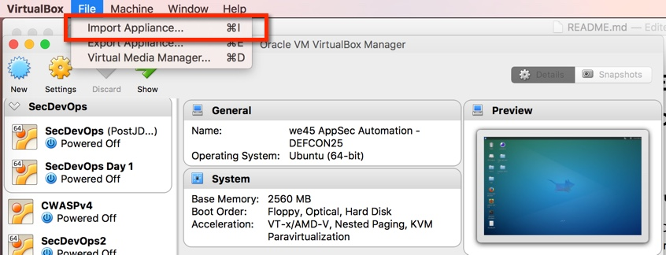
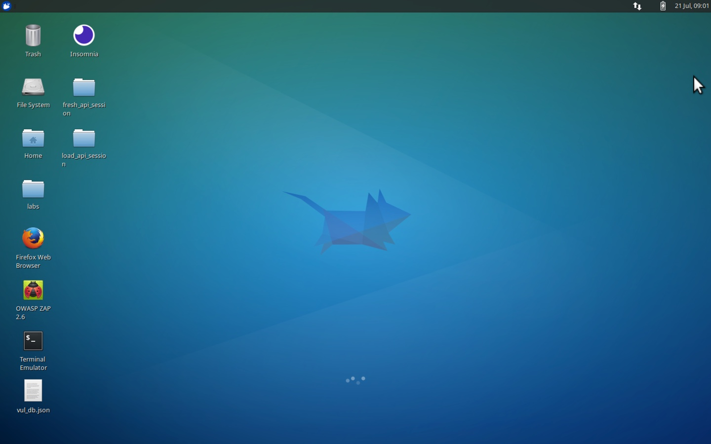
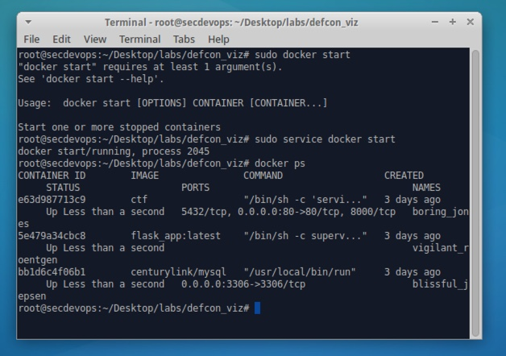
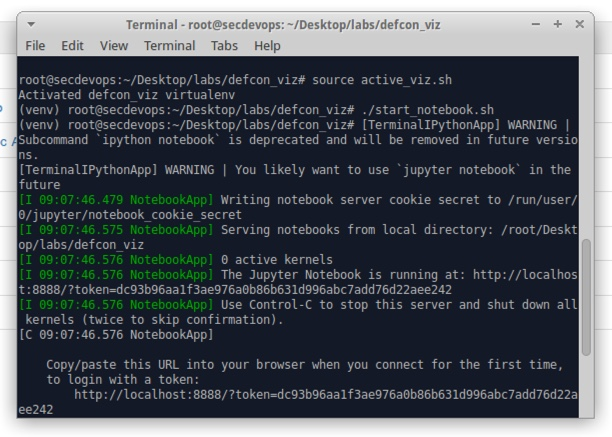
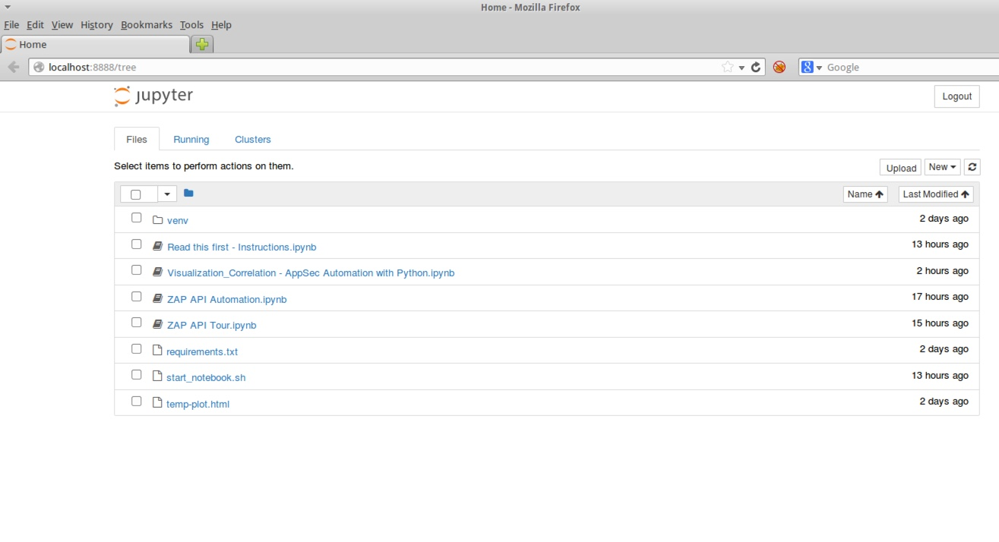

# DEFCON 25 - AppSec Automation Workshop

### By - Abhay Bhargav, CTO - we45

#### Instructions to deploy the VM

* Download VirtualBox 5.1.24 from here: [https://www.virtualbox.org/wiki/Downloads](https://www.virtualbox.org/wiki/Downloads)
* Install Virtualbox Guest Additions as well
* Download the VM (VirtualBox OVA file) from here: [https://drive.google.com/open?id=0ByoRV3VC1qSwcnJCS0pFcDBhYzg](https://drive.google.com/open?id=0ByoRV3VC1qSwcnJCS0pFcDBhYzg)
* MD5.txt Checksum for the ova file is here: [https://drive.google.com/open?id=0ByoRV3VC1qSwa3VkZFAxSlQ1dGc](https://drive.google.com/open?id=0ByoRV3VC1qSwa3VkZFAxSlQ1dGc)
* Once you download the VM and install VirtualBox, you'll have to import the Appliance 
	 
* Wait for OS to boot. Once it boots, you should see the desktop environment: 
	
* 
* To test if everything is working correctly, Open up the `Terminal Emulator` in the Desktop and run the first command `sudo service docker start`. Subsequently, run the command `docker ps`, you should see something like this: 
	
* As a final test, your terminal should automatically be on working directory `/root/Desktop/labs/defcon_viz`, run the commands: 
	* `source active_viz.sh`
	* `./start_notebook.sh`
	* This should start up an iPython notebook and open up the Firefox Browser to point to the iPython Notebook on port 8888
	
	
	
If all this works, you should be good to go!

	

##### Note

* The VM has been configured with a 2560MB of RAM. Please increase it as required
* For Win OSs, you will have to enable Virtualization in the BIOS for VirtualBox and the VM to work
* Networking has been disabled for obvious reasons. This is a vulnerable OS, with vulnerable apps, which is used in a hackercon. Go figure!
* When importing, you might want to check on the `Reinitialize MAC Addresses` in the Import Menu

Feel free to reach out to me on `@abhaybhargav` (Twitter) if you have any questions/issues